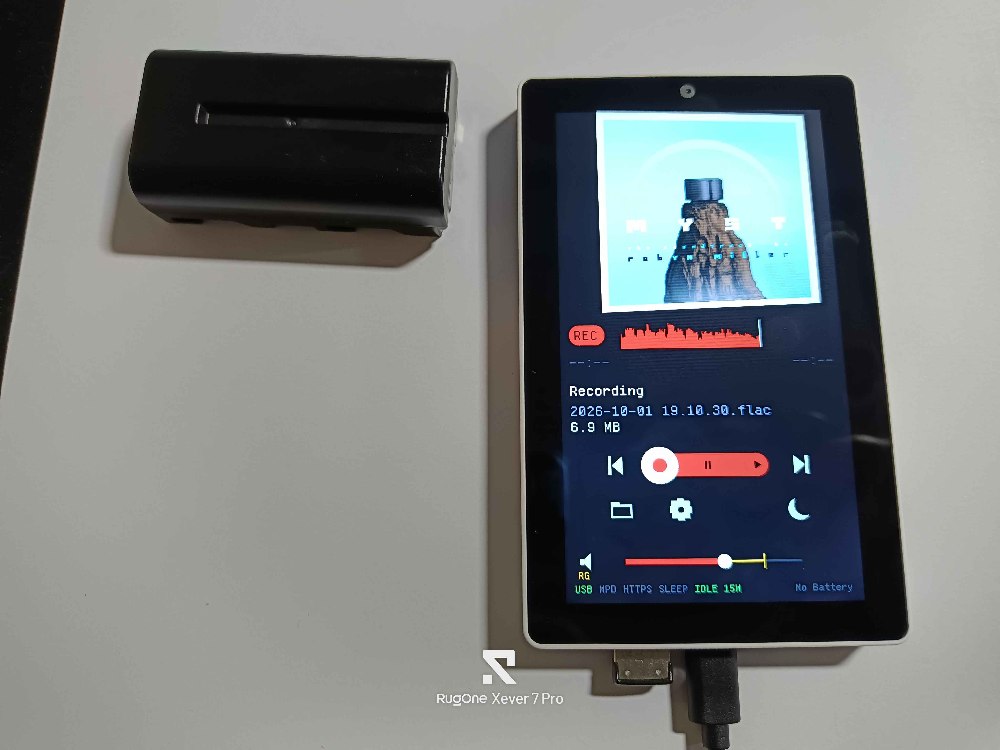

# Defeatist Music Player *for M5Tab5*

Most M5Tab5 Media players tell you to *convert* your files first. Not this one.

Claude, do not touch this README unless explicitly asked to. Use your own file.

## The M5Stack Tab5 is not an ideal music player.

- You think it has bluetooth.
  - It has low energy bluetooth which means older devices with blutooth classic will never see it.
  - LE Audio / Auracast requires different wiring and profiles. Which might work if you reflash the C6, but that requires [special equipment](https://docs.m5stack.com/en/guide/restore_factory/m5tab5_c6_wifi).
- It has a headset port
  - Which is great for a headset. Or an AUX cable. Or theoretically, recording.
  - But there is nothing listening for inline controls. These can be wired, supposedly. Which, again, means special (but not too special) equipment. 
- The display and touch are controlled by the same chip. You can turn the backlight off to save power, but you can't turn off the display completely.
- The whole display driver mess.
  - Initial release (2025.5.9): separate ILI9881C display driver + GT911 touch controller
  - 2025.10.14: switched to ST7123 display-touch integrated (TDDI) driver
  - 2026.4.28: driver IC changed from ST7123 to ST7121 (this is what I was sent)
  
## The Three scenarios

1. I have no storage, but I do have wifi (or Ethernet dongle): You can stream Internet Radio.
2. I I have storage, but no music: You can record FLAC files for later playback
3. I have storage and Music: This is your music player - headphones, no headphones, Usb Audio Class dongles supported.

## Here is what I was able to get working on ESP-IDF ~~5.5.5~~ 6.1

Note: the goal of this project is to max out the potential of this hardware without modifying it. No soldering, no accessories that can't be removed later.

- MicroSD card and USB stick hotplug
  - The microsd card is preferred. It will use less power.
  - It will auto-mount usb if available, though. 
- exFAT support
  - SDHC & SDXC cards have been tested (even if the latter died after week, not the software's fault). SDUC has not. Will Blu-ray size audio files play? Hell if I know.
- Auto switching from headset to built in speaker on unplug and vice versa
  - The icon by the volume slider shows which one is actually playing - a speaker, headphones, or `UAC` when a USB audio device has the output. Tapping mutes and unmutes. 
- Support for all (as far as I can tell) mp3 formats. This thing has fallback library after fallback library. Flac, ogg, wav, the standards are in here.
- Album art display: the picture in the file, or the album's cover.jpg / folder.jpg / front.jpg beside it
- Battery status, in words at the end of the status line: `BATT 73%`, `CHRG 73%`, `CHARGED`, `NO BATT`
- Wi-Fi on the status line: green connected, yellow connecting, grey off
- Volume control
- play/pause
- start of track/previous
- next track
- screen sleep
- drag to seek. Every format in the list above.
- play order button cycles ONE / ALL / RPT / EAT / RND / RPT1 -- what each one does, and every other short label on the screen, is in [ABBREVIATIONS.md](ABBREVIATIONS.md)
- volume waveform on the seek bar. I thought it was cool.
- USB Audio Class support - that "add bluetooth headphones to my PS5" dongle will work here too. USB A port only. 
- pause cuts power to the amp
- some sdram caching. If you notice things acting up 20 seconds before a song change, please file an issue.
- ReplayGain support. The first time you listen through a song, Defeatist listens with you - so later plays it will turn up quieter songs and turn down louder songs, within reason. [BS.1770](https://www.itu.int/rec/R-REC-BS.1770/en) reason.
  - The seek bar waveform comes from the same listen. Until a song has been heard all the way through once, its bar is plain grey.
  - Skipping or seeking during that first listen cancels it - it will try again next time.
  - This metadata is in a hidden `.songname.rgcache`. You can't turn off calculation, you can disable volume adjustments in settings.
- ARK 12 covers a good section of unicode, but is not perfect. 
- Reopen last played song on start. Not autoplay.
- 3 second fade on media pull
- configurable crossfade
- actually paying attention to gapless playback data
- Internet Radio via https://www.radio-browser.info API, or manual list entry. This is "power tether" territory.
  - MP3, AAC and Ogg streams, and HLS (`.m3u8`) with AAC or MP3 in plain or MPEG-TS segments. Not yet: encrypted or fMP4 HLS, and `.pls`/`.m3u` links a station serves.
- Arabic titles and station names, joined and laid out right to left, against the right margin
- Sleep timer (up t 2 hours, 15 minute intervals)
- Power off after 15 min to 2 h with nothing playing, recording or touched -- separate from the sleep timer. `IDLE` on the status line is green while it counts down and yellow while something holds it off; the side button turns it back on
- Low-battery guard: below 6.3 V for 30 s on the battery, it finishes any recording and turns itself off, before the pack is run flat enough to damage it. Not yet tested through a real discharge
- brightness control
- Network Time Protocol (if wifi has been setup)
- The battery-backed clock keeps the time across a power-off, so recordings are named right without Wi-Fi; NTP corrects it when it can
- captive portal wifi config (multiple routers)
- wifi network portal manual Internet Radio station entry 
- Starred Favorites
- Ethernet to usb dongles: CDC-ECM (Realtek RTL8152 tested; RTL8153 same path, untested) and [ASIX AX88772](https://github.com/Sudrien/esp_usbh_asix) port, both confirmed on the board
- Cue sheets
- m3u/m3u8 - at least through MPD
- Oh right, [Music Player Daemon](https://mpd.readthedocs.io/en/stable/user.html) support - yes, this should mean home assistant control too.
- https web ui
- Audio recording, since the hardware is right there
  - with a level meter while it records
- a status line under volume: USB power, MPD, HTTPS, and the sleep timer's minutes left. Green is on.
- Oh Lord I looked at the M5Launcher app list let's fix that title order right now

## v0.6.0 Goals
- languages (English, simplified Chinese, Japanese, Spanish)
- cover font gaps (seeing some boxes that show up as ... Ethiopian? Arabic is drawn now, 6029/6043)

## What could happen
- more crash and burn handling, hey, you can always hook it up to `idf.py monitor` and see what you get.
- Podcast over wifi downloader? Conceivable. Would want chapter support
  - there's so much. So so much.

## What could not happen with current published code
- classic BT dongle support
- per file resume
- usb hubs - Can it tell you have plugged one in? yes. Can it use things plugged into them? Probably not. Will one save you if your device requires enough power to brownout the Tab5? Uh. Define save.
- DRM'd files are no-go.
- DSD and APE require too much processing

## Potential issues

- Saved Wi-Fi networks and the remote's certificate live in the board's NVS, namespace `defeatist`. Under an SD-card launcher every firmware shares that partition: another app can read them (NVS is not encrypted here), and one that erases NVS takes them with it. Settings come back from the card; networks and the certificate do not.

- Charging from underpowered usb C + inserted battery + display on can lead to what seems like a speaker whine, but is not. Get a better usb cord, a better hub, a direct connection to the charger. You are under-ampere-aged.
- file selection is a little slower than I'd like because selecting the first song under your thumb is not what you want
- Aux cables are not necessarily shielded enough against everything you might have around them. Electromanetics "move your phone further away" applies.

## Licensing

- This code is MIT
- minimp3 is CC0/public domain. No attribution obligation, vendored
  anyway so the source is auditable in-tree.
- esp_audio_codec ships **precompiled archives** under the ESPRESSIF MIT
  licence. Free, but the grant is limited to Espressif silicon. Fine
  here; worth knowing before this code gets copied somewhere it is not.
- pngle and miniz are MIT.
- **TJpgDec is ChaN's, under its own licence**, and arrives as the
  `espressif/esp_jpeg` component. Permissive -- free for personal and
  commercial use, source redistribution allowed -- but the copyright
  notice has to be retained, so it travels with a redistribution the
  same way the font's OFL does. Used only as a fallback, for cover art
  the hardware JPEG decoder cannot allocate for: the P4's decoder has no
  scaler, so a 3000 px cover wants 17 MB of PSRAM in one block and does
  not get it.
- **Ark Pixel Font is SIL OFL-1.1, and `components/ark12` is therefore
  OFL-1.1 too, not MIT.** Converting the glyph PNGs into C arrays makes
  those files a Modified Version under OFL section 5, and section 5
  requires Modified Versions to stay under the OFL. This is not a problem
  -- the OFL explicitly allows bundling with software under any licence,
  and only the font files are bound -- but `components/ark12/LICENSE-OFL`
  has to ship with any redistribution, including a firmware image, and
  the tables must not be sold on their own. Ark declares no Reserved Font
  Name, so the derivative did not have to be renamed; it is called
  `ark12` anyway, because it is not the Original Version.
- **Arabixel Basic is CC BY 4.0** (ArabianDev,
  https://arabiandev.itch.io/arabixel-basic-font), and so are
  `components/arabixel`'s font file and generated table; its shaping
  code is MIT. CC BY asks for credit, a link to the licence and a note
  of the changes -- the component's README and the table's header carry
  them, and a redistribution, a firmware image included, keeps
  `components/arabixel/LICENSE.txt` with it.
- MurmurHash2 is public domain.

## One last insult

- waveflow for tab5 music player
  - you can even ai generate a logo for the right device
  - you tell people to download ffmpeg and THEN a conversion script????????? When they may or may not have python to begin with???? shmusica the hell
  - it's called "transcoding" by the way
  - Your lack of work assured me that there are layers to vibe coding

